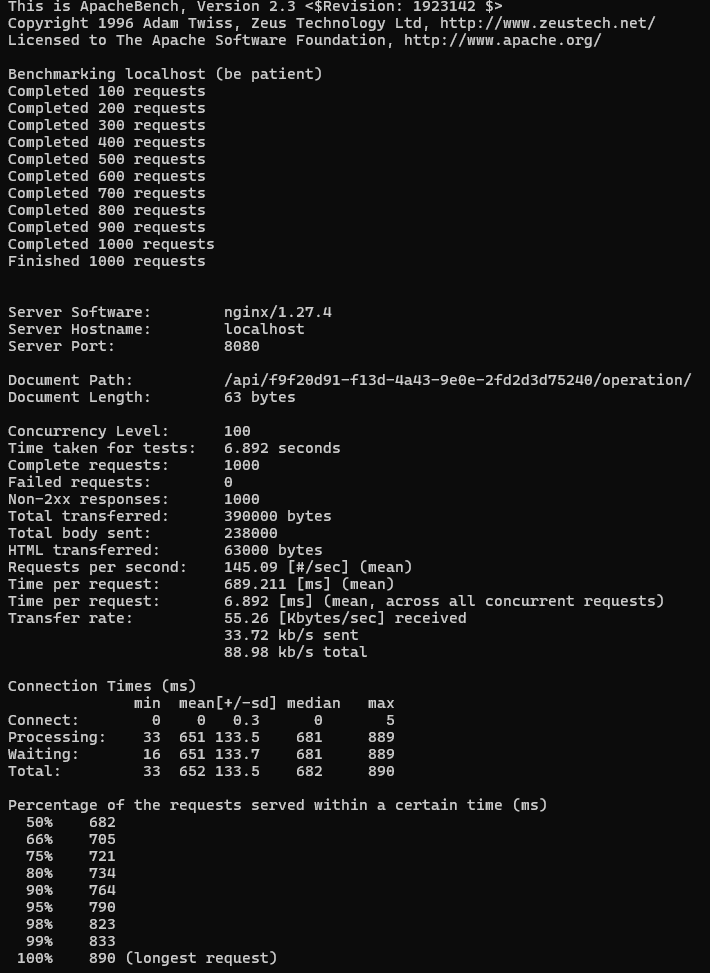

# Wallet API

## 📌 Описание
**Wallet API** — это RESTful API для управления электронными кошельками.

API предоставляет:
- Регистрацию пользователей с автоматическим созданием кошельков
- Пополнение и снятие средств
- Просмотр текущего баланса

Проект разработан с использованием **Django REST Framework**, **PostgreSQL**, **Gunicorn**, **Nginx** и **Docker Compose**.

## 🚀 Основные возможности
- 🔹 **Регистрация пользователей** (`POST /api/register/`)
- 🔹 **Пополнение баланса** (`POST /api/wallets/{WALLET_UUID}/operation/` с `DEPOSIT`)
- 🔹 **Снятие средств** (`POST /api/wallets/{WALLET_UUID}/operation/` с `WITHDRAW` + проверка баланса)
- 🔹 **Просмотр баланса** (`GET /api/wallets/{WALLET_UUID}/`)
- 🔹 **Высокая производительность** (`~240+ RPS` с `gevent` воркерами Gunicorn)
- 🔹 **Покрытие тестами** (юнит-тесты для API и бизнес-логики)

## 🛠️ Используемые технологии
- **Backend:** Python, Django REST Framework
- **Database:** PostgreSQL
- **Production:** Gunicorn + gevent
- **Reverse Proxy:** Nginx
- **Containerization:** Docker, Docker Compose

## 📌 Запуск приложения
### 1️⃣ Установите Docker
[Инструкция по установке Docker](https://docs.docker.com/desktop/)

### 2️⃣ Клонируйте репозиторий
```bash
git clone <URL вашего репозитория GitHub>
cd wallet_final
```

### 3️⃣ Запустите приложение
```bash
docker-compose up --build
```
После запуска API будет доступно по:
- **Админ-панель:** `http://localhost:8080/admin/`
- **API Endpoints:** `http://localhost:8080/api/`

## ✅ Тестирование
Запустите тесты в контейнере:
```bash
docker-compose exec web python manage.py test wallet
```
Ожидаемый результат:
```bash
Ran X tests in ...s
OK
```

## 📊 Производительность
API оптимизировано для высокой нагрузки:

- **RPS (Requests per Second):** ~145
- **Среднее время обработки запроса:** ~689 мс

> ⚡ Примечание: Использование `gevent` воркеров Gunicorn и оптимизированных запросов позволяет API эффективно справляться с высокими нагрузками.

## 📖 Документация
[Полное техническое описание доступно в `DOCUMENTATION.md`](DOCUMENTATION.md)

